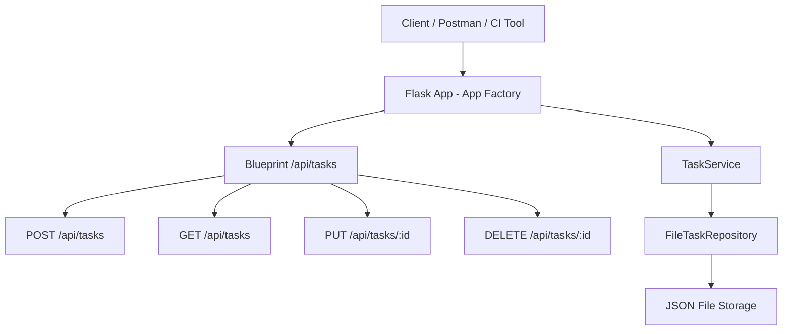

# 🌐 Sprint 3 API Documentation

This document outlines the updated API endpoints and implementation details for Sprint 3 of the TaskTracker project. In this sprint, we continue modularizing the application and introduce object-oriented architecture using a service layer for business logic.

---

## Overview of Changes in Sprint 3

* Introduced `TaskService` class for business logic
* Introduced `TaskRepository` interface for persistence layer
* CLI: Implemented `Mark Task Complete` (US029)
* Introduced automated API tests using `requests` (US035)

**Authentication:** Not required  
**Versioning:** Not required  
**Environment:** Local development only (e.g., http://localhost:5000)  
**Base Route:** `/api`

---
# Sprint 3 API Reference

This document outlines the updated API endpoints and implementation details for Sprint 3 of the TaskTracker project. In this sprint, we continue modularizing the application and introduce object-oriented architecture using a service layer for business logic.

---

## 🧱 Current Endpoints

| Method | URL               | Description                                 |
| ------ | ----------------- | ------------------------------------------- |
| GET    | `/api/health`     | Health check endpoint (US001)               |
| GET    | `/api/tasks`      | Retrieve all tasks (US003)                  |
| POST   | `/api/tasks`      | Add a new task (US002)                      |
| PUT    | `/api/tasks/<id>` | Mark complete or edit title (US004 + US007) |
| DELETE | `/api/tasks/<id>` | Delete a task (US005)                       |

---

## 🔧 Extended Endpoint Behavior

### PUT /api/tasks/<id>

> 📌 `PUT /api/tasks/<id>` now handles two use cases:
>
> * Mark task as complete (`completed: true`)
> * Update the `title` (edit task)

#### ✅ Example Request (Edit Task Title)

```http
PUT /api/tasks/1
Content-Type: application/json

{
  "title": "Update task title"
}
```

#### ✅ Expected Response

```json
{
  "id": 1,
  "title": "Update task title",
  "description": "Previous description",
  "completed": false
}
```

> ✅ Partial updates supported for `title` or `completed` fields.

---

## 🧠 Business Logic: `TaskService`

The service layer abstracts the task logic. It is injected into the controller to promote testability and separation of concerns.

```python
from services.task_service import TaskService

task_service = TaskService(storage_path="data/tasks.json")
```
💡 Note: TaskService separates "what the app does" (business logic) from "how it's stored" (repository), making it easier to swap file storage for a database.
---

## 🔄 Design Note

* Validation ensures:

  * Nonexistent tasks return `404`
  * Empty or invalid payloads return `400`
* Global error handler ensures consistent JSON errors

---

## 🧪 Testing Strategy

### ✅ Updated Testing Strategy

* Unit tests now cover the new `Task` and `TaskService` classes introduced in Sprint 3.
* API route tests use the Flask test client to validate Blueprint-based routing behavior.
* End-to-end automated API tests are written using the `requests` library and stored in `tests/api/test_tasks_api.py`.
* Regression tests confirm that previously implemented endpoints (add, list, complete, delete) remain functional after the object-oriented refactor.
* New CLI feature (US029) calls `TaskService.mark_task_complete()` directly for manual testing.
* API tests from US035 are implemented in `tests/api/test_tasks_api.py` and run via GitHub Actions.
* Unit tests also ensure that business logic remains consistent across refactors, preserving behavior.


---

### 📋 API Architecture Validation Test Cases

✅ **TC-NFR001-001: Routes Accessible via Blueprint**

* Verify `GET /api/health`, `GET /api/tasks`, and `POST /api/tasks` return status `200` or `201` using the Flask test client.
* Ensures routes are correctly registered through `app.register_blueprint()`.

🛠️ **TC-NFR001-002: Modular Architecture Enforcement**

* Manual test: comment out `app.register_blueprint()` in `app/__init__.py`, then verify `GET /api/tasks` returns a `404`.
* Confirms routing is now dependent on Blueprint registration (modular design).

---

✅ These cases ensure that the refactored architecture is functional, testable, and modular—laying the groundwork for database integration in Sprint 4.


---

## 📌 Reminder: ERD and Class Diagram

The current API does not include database integration yet. However, the object model has been updated in the class diagram.

> Full ERD implementation will occur in Sprint 4.

---
## 🪡 Internal Refactor Notes

* `TaskService` is now responsible for handling task logic.
* `FileTaskRepository` abstracts JSON I/O and implements a common `TaskRepository` interface. `FileTaskRepository` is used in Sprint 3 but will be swapped for SQLAlchemy in Sprint 4.
* Routes now reside in `routes/tasks.py` and register via Blueprint.
* `create_app()` wires the app, repository, and service using constructor injection.

---

## 🔍 Testing Considerations

* Unit tests now target the service layer directly.
* Controller tests interact with the service via test clients.
* `tests/` folder includes modular tests like `test_add_task.py`, `test_complete_task.py`, etc.
* Mocking is introduced in some cases to simulate repository behavior.

---

### 🔁 CI Integration Notes

CI continues from Sprint 2 but now additionally validates:

* Modular test coverage of route handlers and service classes
* Successful object-oriented refactor (`TaskService`)
* Continued adherence to endpoint contracts (no regressions)
* ✅ Automated end-to-end API tests using Python’s `requests` library

Your updated GitHub Actions workflow now runs both modular unit tests and full API tests:

```yaml
- name: Run modular unit tests
  run: pytest tests/ --cov=app --cov-report=term-missing

- name: Run automated API tests with requests
  run: pytest tests/api/ --cov=app --cov-report=term-missing
```

> 🧪 Note: `tests/api/` contains external API tests written using `requests` that call the running Flask server, simulating real HTTP traffic.

---

## System Diagram (Sprint 3)



> 🧠 This updated system diagram shows the introduction of OOP, DI, and Blueprint modularity while preserving all endpoint behavior.

---
## 📋 User Stories and Endpoint Summary

## 📋 User Stories and Endpoint Summary

## ✅ Endpoints and CLI Features

| User Story | Title                      | Endpoint or Notes                                 |
|------------|----------------------------|---------------------------------------------------|
| US002      | Add Task                   | `POST /api/tasks`                                 |
| US003      | View Tasks                 | `GET /api/tasks`                                  |
| US004      | Mark Task Complete         | `PUT /api/tasks/<id>`                             |
| US005      | Remove Task                | `DELETE /api/tasks/<id>`                          |
| US007      | Remove Task (CLI complete) | Covered in previous sprint                        |
| US015      | API Error Handling         | Applies to all endpoints                          |
| US029      | CLI UI: Mark Task Complete | CLI-only; uses `TaskService.mark_task_complete()` |
| US035      | API Testing Automation     | Covered by `tests/api/test_tasks_api.py` with `requests` library         |

---

> 🔎 **Note:**  
> - US029 applies to CLI only; does not affect API.  
> - US035 introduces automated testing using `requests`, replacing manual `curl`/Postman.

---

## 📊 Summary

Sprint 3 API documentation confirms that although no new endpoints were added, all previously implemented endpoints now follow a service-oriented, modular architecture with injected dependencies. This refactor supports maintainability, testability, and prepares the app for database migration in Sprint 4.

Next Sprint: Replace JSON persistence with a database, implement models via SQLAlchemy, and extend automated testing to use the `requests` module.
